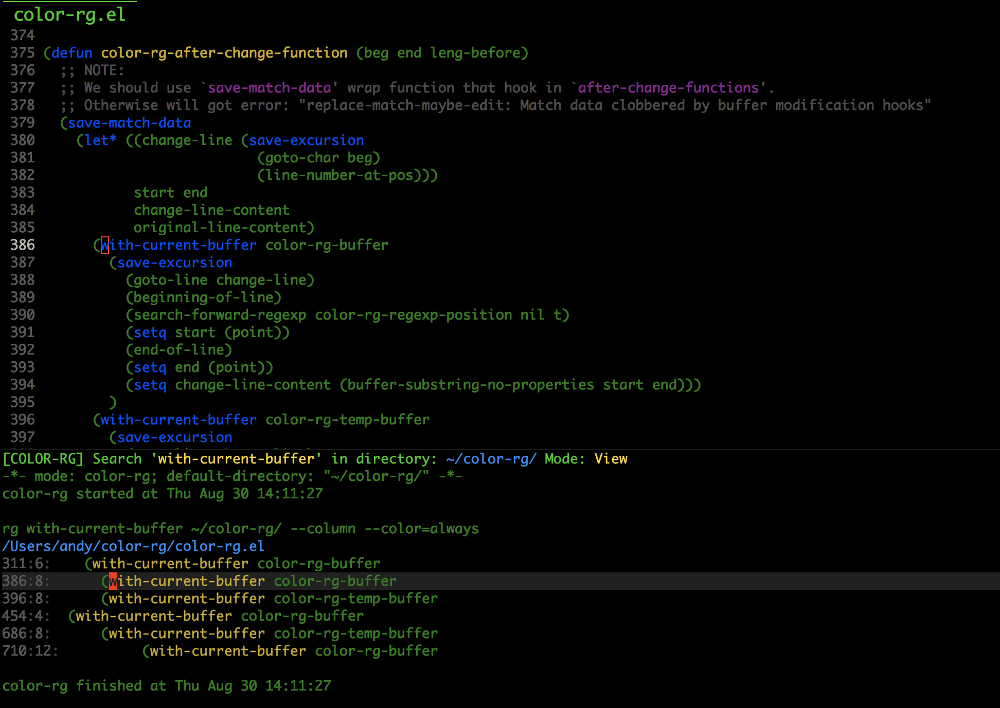

# What is color-rg?
color-rg is search and refactoring tool based on ripgrep.

I'm a big fan of color-moccur.el, this extension's name is used for tribute color-moccur.el!

## Installation

Put `color-rg.el` to your load-path.
The load-path is usually ~/elisp/.
It's set in your ~/.emacs like this:
```Elisp
(add-to-list 'load-path (expand-file-name "~/elisp"))
(require 'color-rg)
```

Bind your favorite key to functions:

| Function                      | Description                                  |
| :--------                     | :----                                        |
| color-rg-search-input         | Search user's input with current directory   |
| color-rg-search-symbol        | Search current symbol with current directory |
| color-rg-search-project       | Search user's input in project               |
| color-rg-search-project-rails | Search user's input in rails project         |

### Keymap for view mode

| Key        | Description                                     |
| :--------: | :----                                           |
| C-a        | Jump to first editable position of current line |
| j          | Jump to next match keyword                      |
| k          | Jump to previous match keyword                  |
| h          | Jump to next match file                         |
| l          | Jump to previous match file                     |
| RET        | Open file relative to match line                |
| r          | Replace all matches                             |
| f          | Filter results with regexp                      |
| s          | Re-search with new keyword                      |
| d          | Re-search with new directory                    |
| i          | Re-search include the ignore files              |
| c          | Re-search with case sensitive                   |
| t          | Re-search pattern as literal                    |
| m          | Re-search with customized rg argument           |
| e          | Enable edit mode                                |
| q          | Quit                                            |

### Keymap for edit mode

| Key        | Description                                     |
| :--------: | :----                                           |
| C-a        | Jump to first editable position of current line |
| C-c C-j    | Jump to next match keyword                      |
| C-c C-k    | Jump to previous match keyword                  |
| C-c C-h    | Jump to next match file                         |
| C-c C-l    | Jump to previous match file                     |
| C-c C-RET  | Open file relative to match line                |
| C-c C-d    | Delete current line                             |
| C-c C-r    | Recover current line                            |
| C-c C-q    | Quit                                            |
| C-c C-c    | Apply changed line to files                     |
